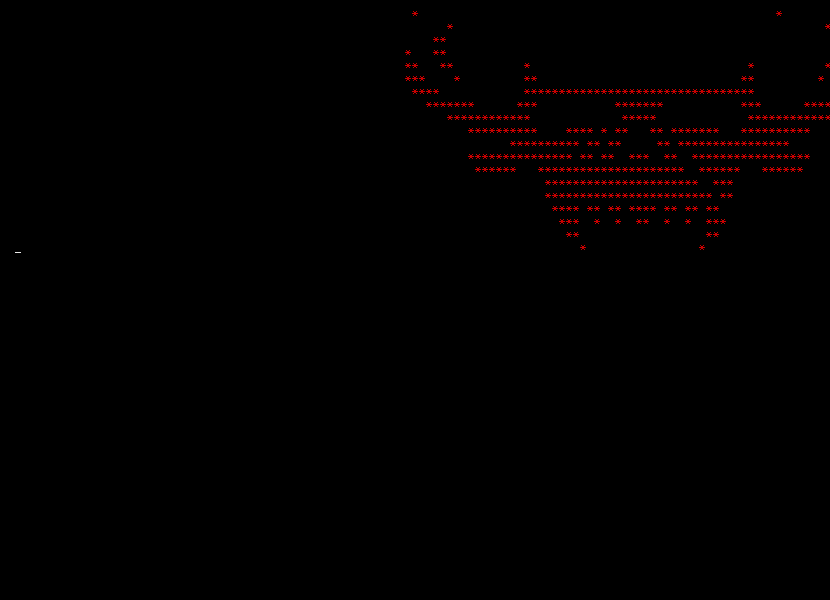

# Hi, I'm ken 

**Offensive Security | Windows Internals | C++ | Pentest | PWN** 

---

### About me

Cybersecurity enthusiast focused on **Offensive Security** and **Windows Internals**. I enjoy understanding how systems work under the hood, from web application vulnerabilities to the internal structure of Windows executables.

I practice regularly on **Hack The Box**, with focus on Web Pentesting, Active Directory, and API Security.

Currently building personal projects in C++ to deepen my understanding of low-level Windows internals and malware development concepts.

---

### Skills

**Web Pentesting**
`SQLi` `XSS` `File Inclusion` `Command Injection` `SSRF` `IDOR` `Broken Access Control` `Race Conditions` `API Abuse`

**Active Directory**
`Kerberoasting` `AS-REP Roasting` `Pass-the-Hash` `Pass-the-Ticket` `DCSync` `BloodHound` `Lateral Movement`

**Post-Exploitation**
`Linux/Windows Privilege Escalation` `Pivoting` `Tunneling` `Port Forwarding`

**Tools**

`sqlmap` `ffuf` `Hydra` `CrackMapExec` `Impacket` `Mimikatz` `Ligolo-ng` `BloodHound`

**Languages & Dev**

---

### Projects

| Project | Description | Lang |
|---|---|---|
| [windows-pe-loader](https://github.com/saitoken241/windows-pe-parser) | Parses DOS/NT headers, sections, imports and exports from Windows DLLs — no external libraries |  |
| [windows-dll-injector](https://github.com/saitoken241/windows-dll-injector) | DLL injection research tool built from scratch |  |
| [DESTROYER](https://github.com/saitoken241/DESTROYER) | Fast subdomain and directory enumeration tool inspired by ffuf |  |
| [REPAIRFAST](https://github.com/saitoken241/REPAIRFAST) | Full-stack web application (frontend + backend) |  |
| [heyprofessor](https://github.com/saitoken241/heyprofessor) | Web project built in PHP |  |
| [Mini-ia](https://github.com/saitoken241/Mini-ia) | AI-related Python project |  |

> Also working on **private malware research projects** (ransomware simulation, process injection) for learning purposes.

---

### Achievements

- 🏆 Participant — **Olimpíada Brasileira de Informática (OBI) 2022**
- 🖥️ Active on **Hack The Box** — [view profile](https://app.hackthebox.com/users/228338)

---

### Goals

Currently building skills towards my first role in **Pentesting**, **Red Team**, or **AppSec**.

---

### HACKTHEBOX

### TEAM
Member of HackersOnSteroids, a top ranked Brazilian CTF team on Hack The Box.

